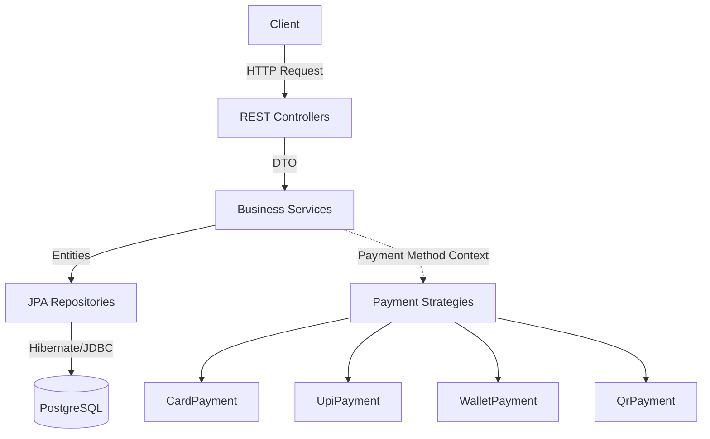
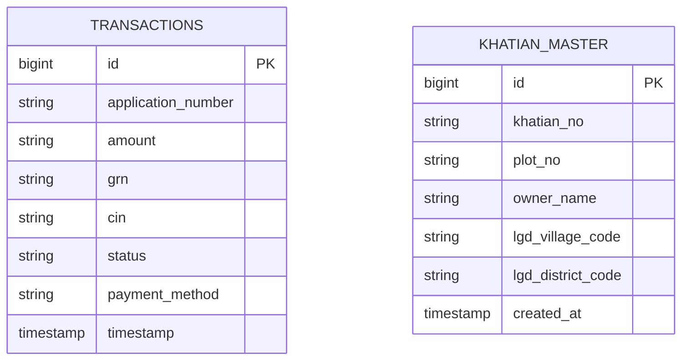
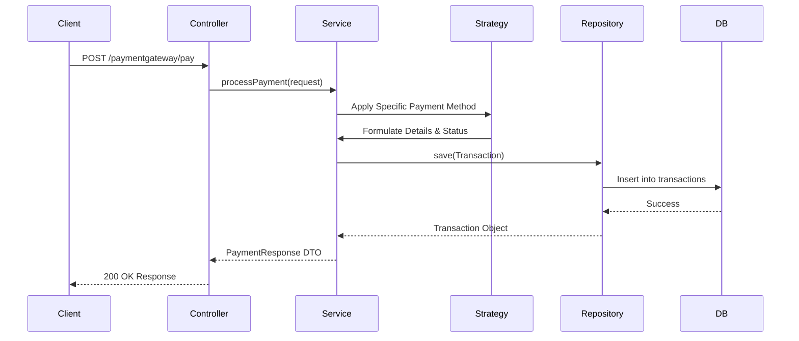

# Payment Gateway & Khatian Verification API

## 1. Project Title
**PaymentGateway Service** - A Spring Boot-based mock payment processing and land record (Khatian) verification module.

---

## 2. Project Overview
The Payment Gateway Service is a unified backend application designed to handle two distinct operations:
- **Payment Processing:** A mock payment gateway that processes transactions using various payment methods (Card, UPI, Wallet, QR Code) and returns generated transaction IDs (GRN/CIN). 
- **Khatian Verification:** A land record verification system that allows users to search Record of Rights (ROR) details based on the owner's name, Khatian number, or plot number.

**Key Use Cases & Target Users:**
- E-governance portals needing land registry (Khatian) validation against state records dynamically.
- Internal applications or mock e-commerce systems needing to simulate complete payment processing flows based on diverse payment methods without interacting with actual financial institutions.

---

## 3. Features
- **Payment Processing:** Support for multiple payment strategies (Card, UPI, Wallet, QR).
- **Khatian Verification:** Fetches land records filtered by village code, supporting searches by Owner, Khatian, or Plot.
- **Transaction Management:** Persists every generated transaction into PostgreSQL.
- **PostgreSQL Integration:** Fully integrated with JPA/Hibernate.
- **Flyway Migration:** Automates the creation and versioning of the `khatian_master` database schema.
- **Validation:** Enforces strict payload structural rules using Jakarta Validation API.
- **Exception Handling:** Global handler transforming errors into readable JSON responses.
- **REST APIs:** Self-documenting Swagger/OpenAPI UI integration.

---

## 4. Architecture Overview
The application follows a standard multi-tier Spring Boot architecture. The Payment Service employs the **Strategy Design Pattern** to delegate payment validations/processing to respective payment method implementations.



### Request Flow
1. **Controller:** Intercepts incoming HTTP requests and triggers basic payload validations.
2. **Service:** Executes business logic (payment processing or khatian lookups).
3. **Repository:** Executes database queries using JPA/Hibernate.
4. **Database:** PostgreSQL stores all persisted transactions and khatian configurations.

---

## 5. Tech Stack

| Layer | Technology | Language |
| --- | --- | --- |
| **Language** | Java 17 | Java |
| **Framework** | Spring Boot (3.2.5) | Java |
| **Database** | PostgreSQL | SQL |
| **ORM** | Hibernate/JPA | Java |
| **Migration** | Flyway | SQL |
| **Build Tool** | Maven | XML |
| **Validation** | Jakarta Validation | Java |
| **Testing** | JUnit, Mockito, H2 db | Java |
| **Logging** | SLF4J (via Lombok) | Java |
| **API Docs** | Springdoc OpenAPI (Swagger) | Java |

---

## 6. Project Structure
```text
src
├── main
│   ├── java
│   │   └── com/example/paymentgateway
│   │       ├── controller          # Core payment REST APIs
│   │       ├── dto                 # Payment Request/Response objects
│   │       ├── entity              # JPA transaction entities
│   │       ├── exception           # Global exception handlers
│   │       ├── repository          # Spring Data JPA repositories
│   │       ├── service             # Payment business logic
│   │       ├── strategy            # Payment strategy implementations
│   │       └── khatian             # Khatian bounded context module
│   │           ├── client
│   │           ├── config
│   │           ├── controller      # Khatian REST APIs
│   │           ├── dto             # Khatian Request/Response objects
│   │           ├── entity          # Khatian JPA entities
│   │           ├── exception       # Khatian specific exceptions
│   │           ├── mapper
│   │           ├── repository      # Khatian queries
│   │           └── service         # Khatian verification business logic
│   └── resources
│       ├── application.properties  # App configurations
│       └── db/migration            # Flyway scripts (e.g., V1__create_khatian_master.sql)
```

---

## 7. Folder Responsibilities

### `controller`
Handles incoming HTTP requests, binds variables, validates input payload fields, and delegates heavy lifting to services.
### `service`
Contains core business operations and application logic.
### `strategy`
Implements behavioral design pattern interfaces to isolate different payment type processing logics (Wallet, UPI, Card, QR).
### `repository`
Interfaces extending `JpaRepository` for seamless CRUD operations avoiding boilerplate database logic.
### `entity`
Mapped relational objects bound to physical database tables (Hibernate automates mapping context).
### `dto` (Data Transfer Objects)
Isolates client-facing Request/Response contracts from base internal entity schemas.
### `khatian/`
A modular breakdown containing completely domain-isolated folders specific to the Khatian feature to ensure high cohesion.
### `exception`
A central piece leveraging `@ControllerAdvice` to enforce uniform JSON error response structures globally.

---

## 8. Database Design

### `transactions`
Auto-generated by Hibernate (`ddl-auto=update`) holding payment processing details.
| Column | Type | Description |
| --- | --- | --- |
| id | BIGINT (PK) | Auto increment primary key |
| application_number | VARCHAR | Original external reference |
| amount | VARCHAR | Processed monetary value |
| grn | VARCHAR | Generated Registration Number |
| cin | VARCHAR | Challan Identification Number |
| status | VARCHAR | SUCCESS / FAILED |
| payment_method| VARCHAR | Type of payment used |
| timestamp | TIMESTAMP | Time of transaction generation |

### `khatian_master`
Provisioned via Flyway containing static land records.
| Column | Type | Description |
| --- | --- | --- |
| id | BIGSERIAL (PK)| Internal identifier |
| khatian_no | VARCHAR(50) | Official khatian record number |
| plot_no | VARCHAR(50) | Sub-plot land identifier |
| owner_name | VARCHAR(255)| Landowner's registered name |
| lgd_village_code| VARCHAR(20) | Village geographical code |
| lgd_district_code| VARCHAR(20)| District geographical code |
| created_at | TIMESTAMP | Initial insertion time |

---

## 9. Entity Relationship Diagram


*(Note: These entities currently operate independently in their respective subdomains without Foreign Keys.)*

---

## 10. API Documentation

### Process Payment
Creates a transaction via mock gateway.
- **Method**: `POST`
- **URL**: `/paymentgateway/pay`
- **Description**: Evaluates payment payloads and yields mock transaction parameters assuming a successful charge.

**Request Example:**
```json
{
  "Applicationnumber": "APP1234567890",
  "amount": "100.00",
  "paymentMethod": "UPI",
  "paymentDetails": {
    "upiId": "user@bank"
  }
}
```

**Response Example:**
```json
{
    "amount": "100",
    "status": "Success",
    "tdate": "05/06/2026",
    "payment_type": "UPI",
    "bankcode": "UPI000999",
    "hash": "c3f8e9b2a1d4e5f6",
    "add_param1": "static",
    "add_param2": "static",
    "add_param3": "static",
    "upi_transaction_id": "UPI835d6e6723",
    "Applicationnumber": "APP1234567980",
    "GRN": "GRN387551293",
    "CIN": "CIN640091958"
}

```

**Validation Rules:**
- `Applicationnumber` must be exactly 13 characters, and cannot be blank.
- `amount` cannot be blank.
- `paymentMethod` cannot be null.

---

### Verify Khatian Record
Searches ROR databases using diverse identifiers.
- **Method**: `POST`
- **URL**: `/khatian_services/verify`
- **Description**: Route validation querying land ownership dependent on search parameters.

**Request Example:**
```json
{
  "search_key": "owner",
  "search_value": "Ramesh",
  "lgd_village_code": "922855"
}
```

**Response Example:**
```json
{
  "status": "SUCCESS",
  "message": "Records found",
  "data": [
    {
       "khatianNo": "8899",
       "plotNo": "55",
       "ownerName": "Ramesh Kumar"
    }
  ]
}
```
**Validation Rules:**
- `search_key`: Must be one of `owner`, `khatian`, or `plot`.
- `search_value`: Value to filter by.
- `lgd_village_code`: Mandatory LGD territory filter.

---

## 11. Payment Module Explanation
- **Payment Flow:** Controller receives the payload. The API identifies the `paymentMethod` field, retrieving the exact configured internal `PaymentStrategy` Bean.
- **Validation Logic:** Core validation occurs at controller DTO level via `@Valid`. Extended behavior depends on Strategy parameters logic (e.g. Card vs UPI details).
- **Database Persistence:** Once handled, a `Transaction` entity is built and saved into the DB asynchronously/synchronously. 



---

## 12. Khatian Module Explanation
- The module is isolated within domain-driven directories underneath `/khatian`.
- Routes via `owner`, `khatian`, or `plot` filters handled sequentially using a Java 14+ switch expression mapping. 
- All mappings intrinsically pass the `lgd_village_code` resolving against PostgreSQL highly optimized indexes.
- Returns a wrapped generalized `ApiResponseDTO` conforming frontend parsing configurations.

---

## 13. Flyway Migrations
| Migration File | Purpose | 
| --- | --- | 
| `V1__create_khatian_master.sql` | Establishes the `khatian_master` table structure and respective LGD based lookup indices. |

- *Current Baseline Schema*: Starting on Version 0 (`spring.flyway.baseline-version=0`).

---

## 14. Configuration
Key components configured within `application.properties`:

- `spring.datasource.url=jdbc:postgresql://localhost:5432/paymentdb`: Points JPA context to PostgreSQL local DB instance target.
- `spring.jpa.hibernate.ddl-auto=update`: Ensures tables (especially `transactions`) automatically create/alter to conform to JPA Entity definitions.
- `spring.flyway.baseline-on-migrate=true`: Safe-guarding migration executions on pre-existing unsync databases ensuring structural baselines.
- `spring.jpa.show-sql=true`: Dumps SQL onto the console.

---

## 15. Local Setup Guide

### Prerequisites
- Java Development Kit (JDK 17)
- Apache Maven
- PostgreSQL database engine running locally on port 5432.

### Step-by-Step

1. **Clone Repository (Assume remote)**
```bash
git clone <repository-url>
cd PaymentGateway
```

2. **Create Local Database**
Execute this via `psql` or PGAdmin:
```sql
CREATE DATABASE paymentdb;
```

3. **Configure Database Settings**
Access `src/main/resources/application.properties` to map your local PostgreSQL login:
```properties
spring.datasource.username=postgres
spring.datasource.password=Loki@000000
```

4. **Start Application**
Since Flyway and Hibernate update are active, Boot will natively compose schemas upon execution.
```bash
mvn spring-boot:run
```
**Expected Output:** Console displays Spring ASCII banner and ends with `Tomcat initialized with port(s): 8080`, confirming operational stability.

---

## 16. Testing Guide
### Using Postman

**1. Payment Testing Endpoint:**
```json
POST http://localhost:8080/paymentgateway/pay
Content-Type: application/json
{
  "Applicationnumber": "APP1234567890",
  "amount": "1000",
  "paymentMethod": "UPI",
  "paymentDetails": {
    "upiId": "user@okbank"
  }
}

```

**2. Khatian Verification Endpoint:**
```json
POST http://localhost:8080/khatian_services/verify
Content-Type: application/json
{
  "search_key": "plot",
  "search_value": "45",
  "lgd_village_code": "922855"
}

```

---

## 17. Sample Data
Inject this DML via PostgreSQL query tool once the schema exists for basic evaluation:

```sql
INSERT INTO khatian_master (khatian_no, plot_no, owner_name, lgd_village_code, lgd_district_code) 
VALUES 
('121', '10', 'Alex Doe', '922855', '111'),
('122', '55', 'Ramesh Kumar', '922855', '111'),
('123', '99', 'Jane Smith', '922855', '220');
```

---

## 18. Logging
Logging leverages SLF4J (via Lombok's `@Slf4j`). Key logging occurrences exist extensively over Controller scopes (e.g., `KhatianController`) outputting parameter tracking details (`log.info`).

---

## 19. Validation
Global validations implemented via `jakarta.validation`:
- `@NotBlank(message = "...")`: Prevents nulls, spaces, or empty states on `search_key`, `search_value`, `applicationNumber`, and `amount`.
- `@NotNull`: Secures `paymentMethod` preventing Enum matching crashes.
- `@Size(min = 13, max = 13)`: Hardens `applicationNumber` formatting consistency.

---

## 20. Exception Handling
Driven by `@ControllerAdvice` in `GlobalExceptionHandler.java`:
- **MethodArgumentNotValidException:** Traps `@Valid` failures rendering a map of exact field errors. Explicitly corrects `applicationNumber` reference masking via runtime iteration string translation.
- **IllegalArgumentException:** General application flow traps resulting in `400 Bad Request`.
- **KhatianNotFoundException:** Target specific 404/400 exceptions when Land registries yield empty datasets.

---

## 21. Security
- **Current State:** The APIs denote primarily an open interface architecture allowing isolated unauthenticated internal network microservice inquiries (No Spring Security dependencies imported).
- **Network Boundaries:** Application relies strictly on firewall constraints and network bounding rather than granular JWT/Bearer application layer implementations.

---

## 22. Build & Deployment

### Package Generation
```bash
# This cleans target artifacts and builds utilizing standard JUnit execution validations.
mvn clean install
```
### Standalone Execution
```bash
java -jar target/payment-gateway-0.0.1-SNAPSHOT.jar
```

---

## 23. Troubleshooting
- **PostgreSQL Connection Failure:** Verify credentials matching within properties file and Postgres daemon functionality status.
- **Flyway Database Migrations Failing:** Often caused if modifying `V1__create_khatian_master.sql` post-baseline. Drop the physical database, recreate the db, and let application orchestrate bootstrapping.
- **Validation Failures (Code 400):** Ensure payloads accurately encompass case-sensitive parameters (`Applicationnumber` vs `applicationNumber`).
- **Port Conflicts:** Ensure `8080` isn't utilized. Override `server.port=9090` internally within `application.properties` to fix binding panics.

---

## 24. Future Improvements
1. **API Security:** Wrap public endpoints within Spring Security leveraging JWT-based stateless authorization modules.
2. **Flyway Consolidation:** Unify the `transactions` JPA auto-generation into Flyway explicit schemas (`V2__create_transactions.sql`) removing `spring.jpa.hibernate.ddl-auto=update` from production configurations for strict integrity controls.
3. **Caching Layer:** Adopt Redis (`@Cacheable`) on Khatian requests since land records infrequently shuffle to drastically increase lookup latencies.

---

## 25. Contributors
- Developed collaboratively as part of the Payment Gateway module integrations team.
